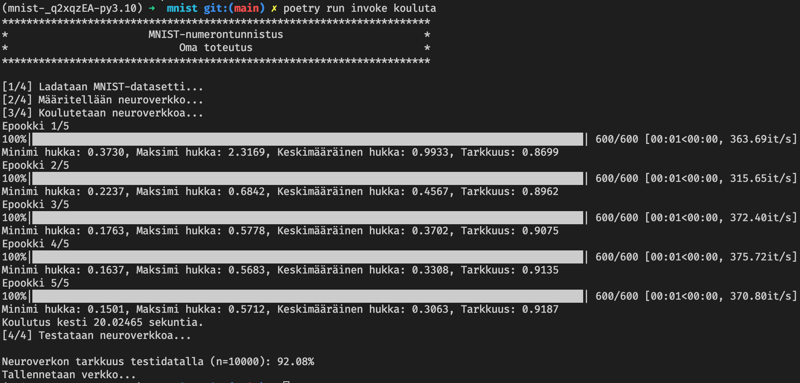
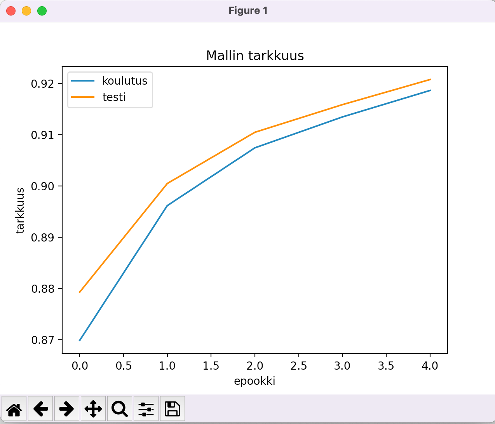
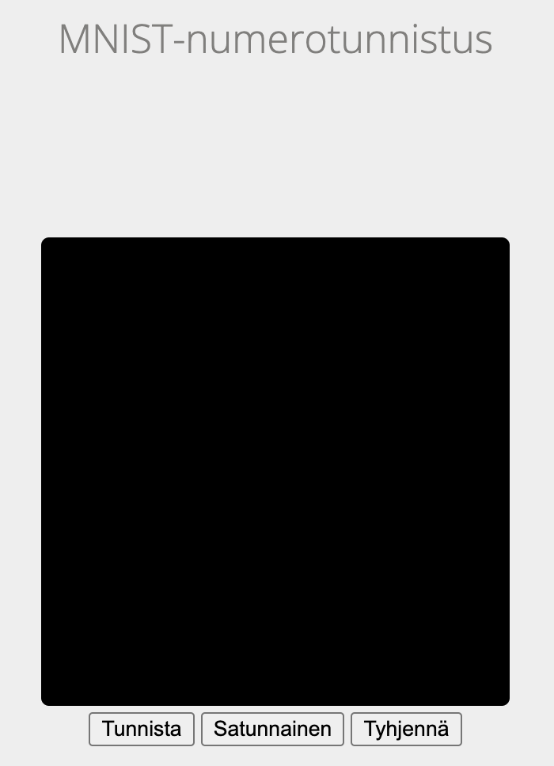
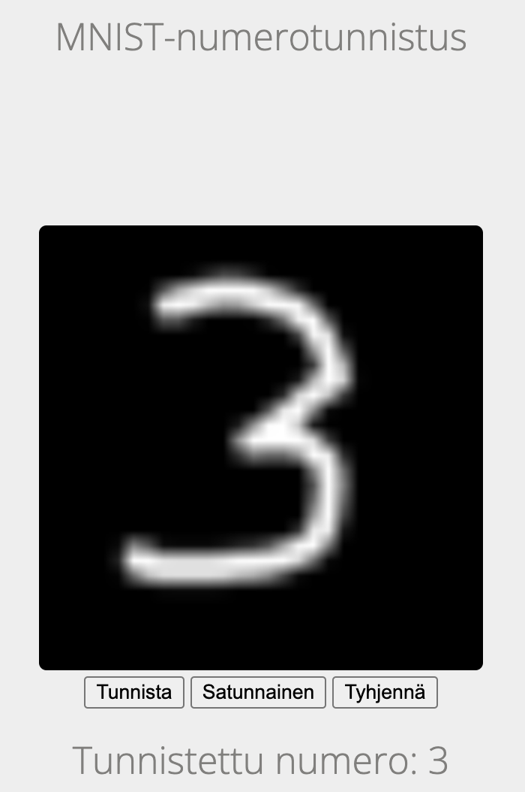
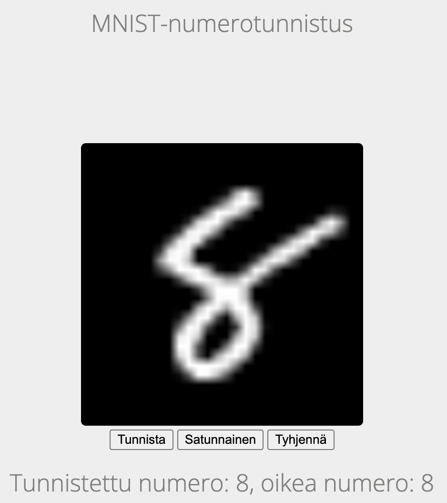

# Käyttöohje

### Asennus

Vaatimukset:

- Python 3.10
- Poetry

Riippuvuuksien asennus:

`poetry install`

### Neuroverkon koulutus

`poetry run invoke kouluta`

Koulutuksen loppuvaiheessa ruudulle pitäisi tulla kaksi kaaviota tarkkuuden ja hukkafunktion kehittymisestä koulutusepookkien aikana.

Koulutuksen jälkeen neuroverkko on tallennettu `neuroverkko.pkl`-nimiseksi Pickle-tiedostoksi, jota käyttöliittymä käyttää.

### Käyttöliittymän käynnistäminen

`poetry run invoke app`

Siirry selaimella osoitteeseen http://localhost:8000

Käyttöliittymä näyttää seuraavalta:

**Käsin piirtäminen**

Piirrä numero hiirellä mustaan laatikkoon ja paina "Tunnista". Voit tyhjentää ruudun painamalla "Tyhjennä".

**Satunnainen numero MNIST-tietokannasta**

Valitse "Satunnainen". Ohjelma valitsee MNIST-tietokannan testidatasta 10000 esimerkin joukosta numeron testattavaksi.

