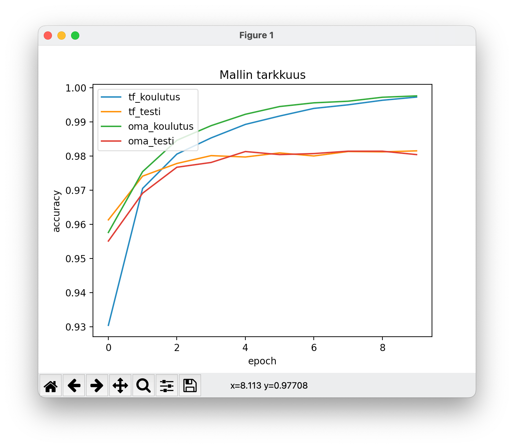
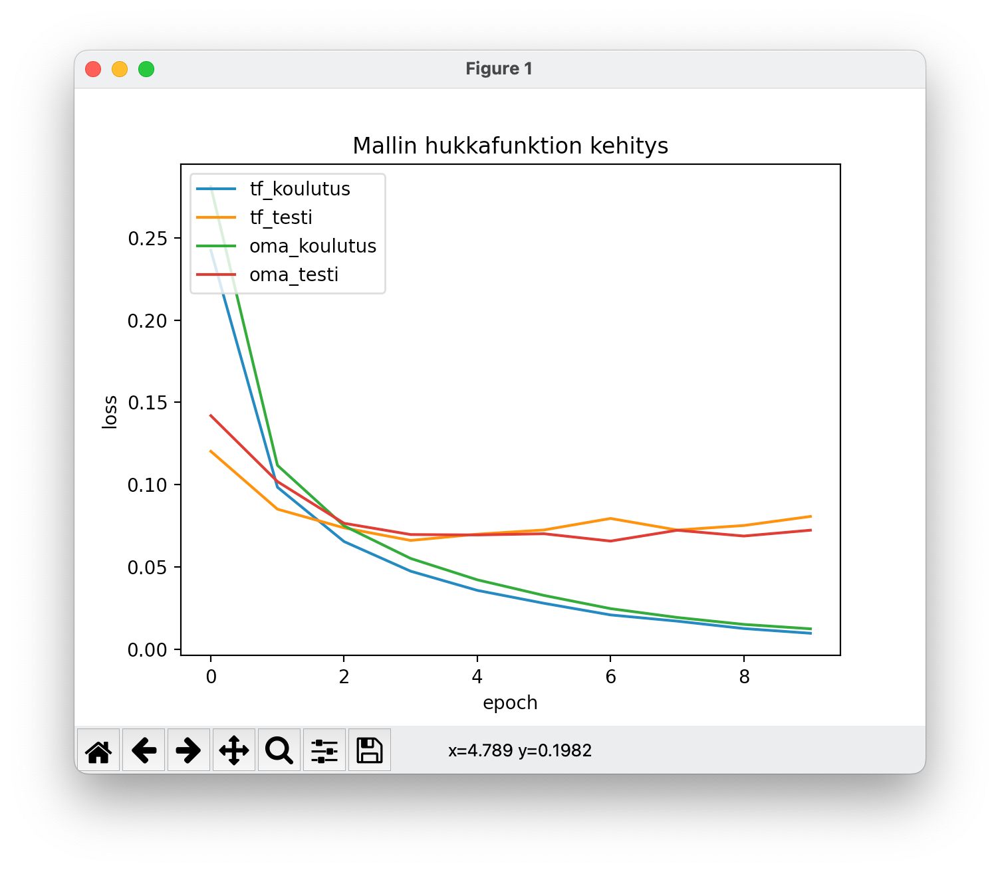

# Testausdokumentti

Yksikkötestaus on tehty vain neuroverkolle, `src/neuroverkko.py`, koska muu on käyttöliittymää.

Testauksessa käytetään jonkin verran keras-kirjastoa, jotta voidaan todeta, että minun toteutukseni tuottaa saman tuloksen.
Neuroverkon toiminnan testaus tehdään lukitsemalla painot ja vakiot testausvaiheessa ja käyttämällä hyvin yksinkertaista verkkoa.

Testikattavuusraportti löytyy Codecovista: [linkki](https://app.codecov.io/gh/pontushed/tkt20010/blob/main/src/neuroverkko.py)

Testikattavuus on tällä hetkellä: 

Neuroverkon suhteen tärkeintä onkin todeta, toimiiko se yhtä tarkasti kuin referenssi, eli tässä tapauksessa TensorFlow/Keras. Keras on hyvin optimoitu, joten pelkällä pythonilla ja numpyllä toteutettuna ei pääse nopeudessa yhtä hyvään lopputulokseen, mutta tarkkuuden tulisi olla lähes sama ja oppiminen tulisi tapahtua samalla tavalla, mikäli neuroverkon arkkitehtuuri on sama.

Ajamalla `vertailu.py`-skriptin voidaan verrata omaa toteutusta ja keras-toteutusta. Mallin koulutus tehdään 60000 esimerkillä ja testaus 10000 esimerkillä, joka on vakiomäärä MNIST-datasetillä.

Kouluttamalla neuroverkkoja 10 epookilla, oli tulokset seuraavat omalla koneellani:

| Toteutus | Koulutusaika | Saavutettu tarkkuus testidatalla (n=10000) |
| -------- | ------------ | ------------------------------------------ |
| TF/Keras | 25,49 s      | 98%                                        |
| Oma      | 69,15 s      | 98%                                        |

Vertailu tarkkuuden kehittymisestä:

Vertailu hukkafunktion kehittymisestä:

Kaavioista huomaa pari asiaa:

- tarkkuus testidatalla jää noin 98% tasolle
- kolmannen epookin jälkeen hukka testidatalla ei pienene

## Ristiinvalidointi

Ajamalla `vertailu-ristiinvalidointi.py`-skriptin voidaan verrata omaa toteutusta ja keras-toteutusta käyttäen ristiinvalidointia K-osoituksella. Mallin koulutus tehdään 60000 esimerkillä ja testaus 10000 esimerkillä, joka on vakiomäärä MNIST-datasetillä.
Ennustuskyky arvoidaan arvolla k=5, jossa ensin yhdistetään alkuperäinen opetus- ja testausdata, josta sitten erotetaan testidata viidestä eri kohdasta ja koulutetaan mallit uudelleen ja verrataan tuloksia. Lopuksi otetaan keskiarvo testidatalla saavutetusta tarkkuudesta.

Kouluttamalla neuroverkkoja 10 epookilla viisi kertaa ristiinvalidoinnilla, oli tulokset seuraavat omalla koneellani:

| Iteraatio       | TF/Keras | Oma     |
| --------------- | -------- | ------- |
| 1               | 98.24%   | 98.26%  |
| 2               | 97.93%   | 98.19%  |
| 3               | 97.51%   | 97.57%  |
| 4               | 97.93%   | 97.82%  |
| 5               | 98.08%   | 97.90%  |
| **Keskimäärin** | 97.938%  | 97,984% |
