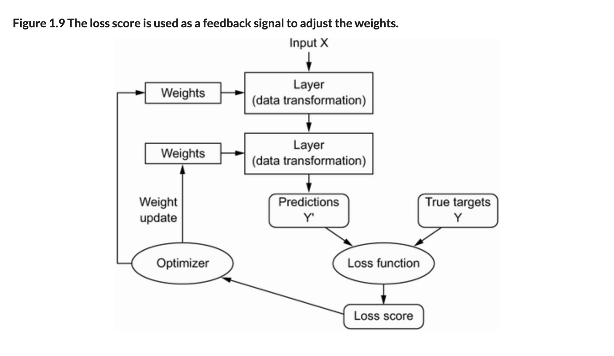

# Toteutusdokumentti

Neuroverkon toteutuksen osa-alueet:


_Kuva: Francois Chollet: Deep Learning with Python, 2nd Edition (2021) [Linkki](https://livebook.manning.com/book/deep-learning-with-python-second-edition)_

- Tiedon lataaminen
- Neuroverkon alustaminen moniluokkaiseen luokitteluun

  - sisääntulokerros
  - välikerros aktivointifunktioineen
  - ulostulokerros

- Kouluttamisvaihe virheen minimoimiseksi

  - Forward propagate
  - Virheen laskeminen ja backpropagate (neuroverkon kouluttaminen)

- Neuroverkon käyttäminen ennustamiseen

## Neuroverkon arkkitehtuuri

Tein referenssitoteutuksen TensorFlow/Keras-kirjastolla _Deep Learning with Python_-kirjan esimerkin mukaisesti. Toteutan saman arkkitehtuurin itse, joten arkkitehtuuri on seuraava:

1. Sisääntulokerros
2. Välikerros aktivointifunktiolla ReLU
3. Ulostulokerros aktivointifunktiolla Softmax

### Toimintaperiaate

Neuroverkon koulutus tapahtuu seuraavasti:

1. Alustetaan neuroverkon painokertoimet (pienillä) satunnaisluvuilla ja vakiokertoimet nollina epäsymmetrisyyden luomiseksi
2. Otetaan syötteestä $n$ alijoukkoa (engl. _batch_)
3. Alijoukkokohtaisesti:

- Viedään yksittäinen syöte neuroverkon läpi ja lasketaan virhe
- Ajetaan vastavirta-algoritmi (engl. _backpropagation_) jolla lasketaan gradientti painokertoimien suhteen kerroksittain viimeisestä ensimmäiseen
- Käytetään optimointimenetelmää (tässä toteutuksessa RMSprop)
- Päivitetään painokertoimet ja vakioarvot

4. Kun kaikki alijoukot on käyty läpi, ollaan päästy epookin (engl. _epoch_) loppuun ja palataan kohtaan 2, kunnes haluttu määrä epookkeja on käyty läpi. Mikäli neuroverkon koulutus ei paranna tarkkuutta, voidaan koulutus myös keskeyttää aikaisemmin (engl. _Early stopping_)

### Käytännön toiminta

Kuvat muunnetaan 28x28 pikselin muodosta 784 alkion pituiseksi vektoriksi.

Sisääntulokerros: Vektori $x \in \mathbb{R}^{784}$

Välikerros: 512 neuronia, aktivointifunktio ReLU

Laskutoimitus välikerroksessa:

$W^{(1)} \in \mathbb{R}^{784\times512}, b^{(1)} \in \mathbb{R}^{512}, \phi^{(1)} = ReLU(x)$

$o^{(1)}= \phi^{(1)}(W^{(1)}\cdot x + b^{(1)})$

Ulostulokerros: 10 neuronia, aktivointifunktio Softmax

Laskutoimitus ulostulokerroksessa

$W^{(2)} \in \mathbb{R}^{512\times 10}, b^{(2)} \in \mathbb{R}^{10}, \phi^{(2)} = softmax(x)$

$o^{(2)} = \phi^{(2)}(W^{(2)}\cdot o^{(1)} + b^{(2)})$

### Koulutetun neuroverkon tavoite

Jos syöte on esimerkiksi kuva, joka esittää numeroa 7,
tulee verkon ulostulokerroksen jälkeisen vektorin arvot olla mahdollisimman lähellä:

$$
\hat{y} = \begin{bmatrix}
0.0\\ % indeksi 0
0.0\\ % indeksi 1
0.0\\ % indeksi 2
0.0\\ % indeksi 3
0.0\\ % indeksi 4
0.0\\ % indeksi 5
0.0\\ % indeksi 6
1.0\\ % indeksi 7
0.0\\ % indeksi 8
0.0  % indeksi 9
\end{bmatrix}
$$

, jolloin indeksi 7:ssä on suurin todennäköisyysarvo. Ennustetun numeron saa tällöin helposti esiin koodilla:

```python
ennustus = y_hattu.argmax() #7
```

# Matemaattinen tausta

**Neuroni**

Neuroni koostuu painoarvomatriisista $W$ ja vakioarvosta $b$, sekä aktivointifunktiosta $\sigma$.

Neuronin ulostulo lasketaan kaavalla $y=\phi(W \cdot \vec{x}+b)$

**Aktivointifunktio ReLU**

Tässä toteutuksessa käytetään välikerroksen aktivointifunktiona ReLU-funktiota (engl. Rectified Linear Unit)

$$
\phi(x) = \begin{cases}
0 & x \leq 0 \\
x & x > 0
\end{cases}
$$

```python
def relu(x: NDArray[np.float64]) -> NDArray[np.float64]:
    return np.maximum(0, x)
```

**Aktivointifunktion ReLU derivaatta**

$$
\phi'(x) = \begin{cases}
0 & x \leq 0 \\
1 & x > 0
\end{cases}
$$

```python
def relu_gradientti(x: NDArray[np.float64]) -> NDArray[np.float64]:
    return np.where(x > 0, 1, 0)
```

**RMSprop**

RMSprop on gradienttimenetelmän optimointialgoritmi, jonka toimintaperiaate on pääpiirteittäin:

- Kerätä gradienttien neliöiden liukuvaa keskiarvoa
- Päivittää gradientit jakamalla ne keskiarvon neliöjuurella

Linkki: [TensorFlow RMSProp](https://keras.io/api/optimizers/rmsprop/)

Lähde: [Hinton, 2012](https://www.cs.toronto.edu/~tijmen/csc321/slides/lecture_slides_lec6.pdf)

Liukuvan keskiarvon laskenta

$$
E[g^2]_t = \rho E[g^2]_{t-1} + (1-\rho)g_t^2
$$

jossa $\rho$ on vaimennuskerroin, oletuksena 0,9

Gradienttien päivitys

$$\vec{\theta}_{t+1} = \vec{\theta_t} - \frac{\eta}{\sqrt{E[g^2]_t+\epsilon}}\vec{g}_t$$

jossa

- $\vec{\theta}_{t+1}$ painot uuden iteraation jälkeen
- $\vec{\theta}_{t}$ painot
- $\eta$ oppimisvauhti (learning rate), oletusarvo 0,001
- $E[g^2]_t$ nykyisen alijoukon gradienttien keskiarvon neliö
- $\epsilon$ Pieni epsilon-arvo estämään nollalla jaon, oletusarvo 1e-07
- $\vec{g}_t$ gradientit

**Softmax**

Ulostulokerroksen aktivointifunktiona käytetään Softmaxia, jonka tuloksena ulostulokerroksen neuronien arvot muodostavat vektorin todennäköisyyksistä luokkakohtaisesti, jossa arvojen summa on 1.

$$\vec{y} = softmax(\vec{x}) = \frac{e^{x_i}}{\sum_{i=1}^{n}e^{x_i}}$$

```python
def softmax(x: NDArray[np.float64]) -> NDArray[np.float64]:
    return np.exp(x)/np.sum(np.exp(x))
```

Softmaxin derivaattafunktio:

oletetaan, että $$\vec{y}=\begin{bmatrix}
y_1 \\
y_2 \\
y_3 \\
y_4
\end{bmatrix}$$

$$
softmax'(\vec{x}) = \vec{y} \odot \left ( \begin{bmatrix}
1 & 0 & 0 & 0\\
0 & 1 & 0 & 0\\
0 & 0 & 1 & 0 \\
0 & 0 & 0 & 1
\end{bmatrix} - \vec{y}^T \right )
$$

$$\Rightarrow softmax'(\vec{x}) = softmax(\vec{x})\odot(I-softmax(\vec{x})^T)$$

Huom.: $\odot$ tarkoittaa elementtikohtaista kertolaskua,eli [Hadamardin tuloa](<https://en.wikipedia.org/wiki/Hadamard_product_(matrices)>).

```python
def softmax_dash(x: NDArray[np.float64]) -> NDArray[np.float64]:
    I = np.eye(x.shape[0])
    return softmax(x) * (I - softmax(x).T)
```

**Hukkafunktio: ristientropia**

Jotta neuroverkkoa voidaan kouluttaa, on laskettava numeerinen arvo virheelle. Tätä kutsutaan hukkafunktioksi. Koulutuksen tavoitteena on minimoida hukkafunktion arvo.

Koska tässä toteutuksessa on kyse luokittelusta, niin käytetään ristientropiafunktiota:

$$RE = -\sum_{i=1}^n y_i \cdot log(\hat{y}_i)$$

```python
def ristientropia(y, y_hattu):
    # Huom! Lisätään 1e-100 y_hattu-arvoon, jotta vältetään nollalla jako np.log-funktiossa
    return np.sum(y * np.log(y_hattu + 1e-100))
```

**Ristientropian derivaattafunktio**

Oletetaan, että $RE = f(\hat{y}_1, \hat{y}_2, \hat{y}_3)$

Tällöin gradientti on:

$$
J = \frac{\partial RE }{\partial (\hat{y}\_1, \hat{y}\_2, \hat{y}\_3)}=\begin{bmatrix}
\frac{\partial RE}{\partial \hat{y}\_1} \\
\frac{\partial RE}{\partial \hat{y}\_2} \\
\frac{\partial RE}{\partial \hat{y}\_3}
\end{bmatrix}
$$

$$
\Rightarrow J = \begin{bmatrix}
\frac{-y_1}{\hat{y}\_1} \\
\frac{-y_2}{\hat{y}\_2} \\
\frac{-y_3}{\hat{y}\_3} \\
\end{bmatrix} = -\frac{y}{\hat{y}}
$$

```python
def ristientropia_gradientti(
    y: NDArray[np.float64],
    y_hattu: NDArray[np.float64]
) -> NDArray[np.float64]:
    return y / (y_hattu + 1e-100)
```
